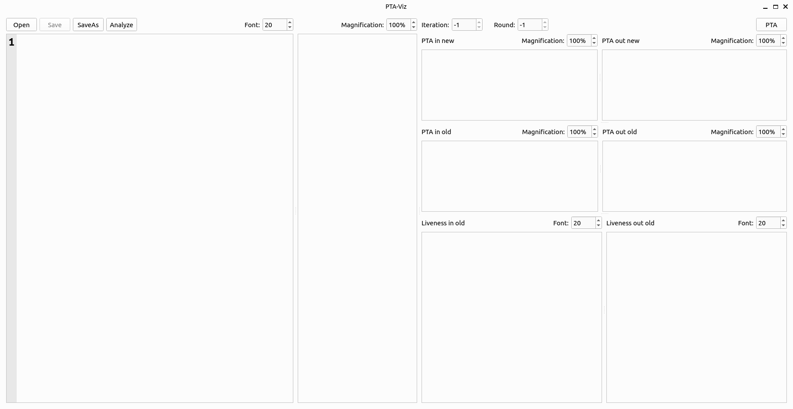
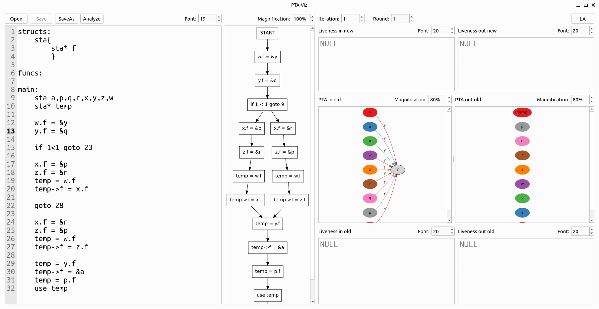
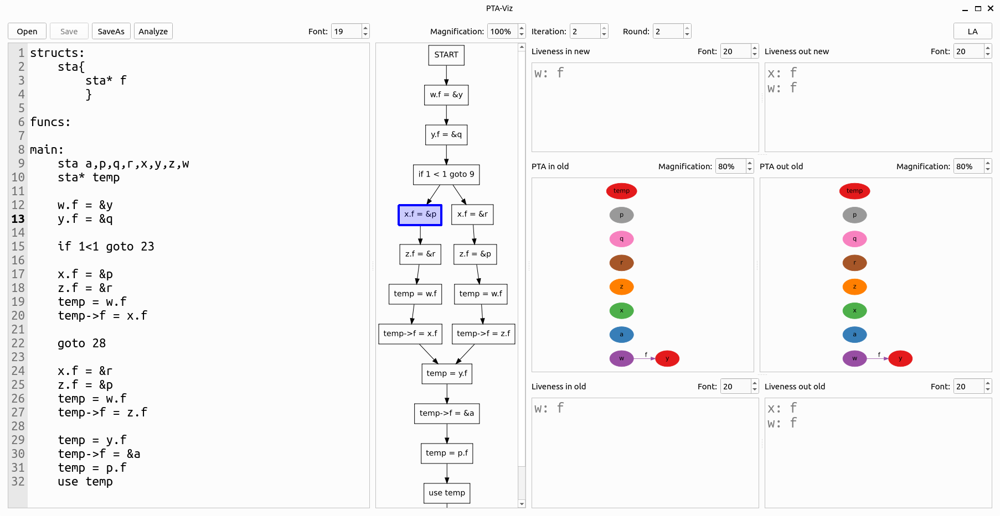
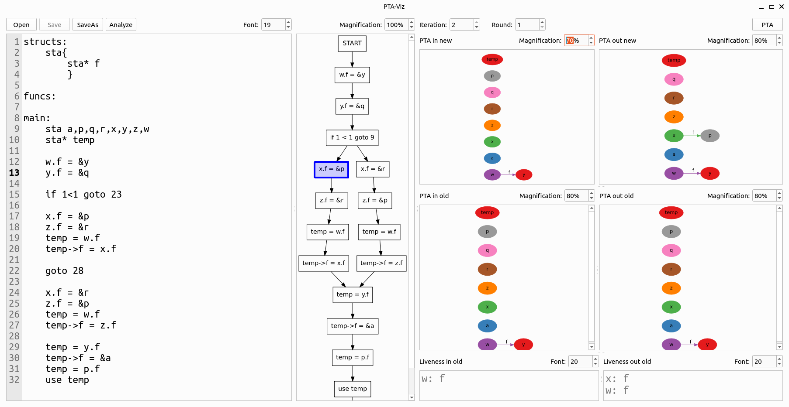

# PTA-Viz

Points To Anaylis Visualiser (PTA-Viz) is an interactive tool for visualisation of various PTA algorithms.

## Dependencies

To run the code, you will first need to install the following dependencies:
1. Python packages:
    - [PLY](https://pypi.org/project/ply/)
    - [graphviz](https://pypi.org/project/graphviz/)
    - [PyQt6](https://pypi.org/project/PyQt6/)
2. Apps:
    - [Graphviz](https://graphviz.org/download/) (Graphviz app is needed along with the graphviz python package)

## How to use PTA-Viz with GUI

1. Open the terminal and navigate to the directory where the code is located (if downloaded from GitHub, the code will be located inside the 'RnD' directory)
2. To start the GUI, enter the following command into the terminal:
    ```shell
    python3 gui.py
    ```
3. The following window will appear:
    
4. Now, you can either type the code you want to analyse, or load the code from an existing file. Then, press the 'Analyse' button to  perform PTA on the code (currently the program performs Andersen's, Steensgaard's, FSPTA and LFCPA, but displays the results of LFCPA only).
    
5. Using the CFG, you can view the analysis results for each statement/block. The 'Iteration' and 'Round' spinboxes can be used to see the results of specific analysis rounds and iterations. The 'LA' or 'PTA' button at the top right corner of the window can be used to toggle between liveness analysis and points to analysis (for LFCPA).
    
    
6. The results are also stored in the 'results' folder.

## How to use PTA-Viz without GUI (mainly for testing PTA code before writing its GUI code)

1. Open the terminal and navigate to the directory where the code is located (if downloaded from GitHub, the code will be located inside the 'RnD' directory)
2. To start the GUI, enter the following command into the terminal:
    ```shell
    python3 main.py <path_to_file_containing_code>
    ```
3. Alternately, you can also use the command:
    ```shell
    python3 main.py
    ```
    This will look for a file named 'test.txt', in the current directory, and use its contents as the code to be analysed.
4. This will perform Andersen's, Steensgaard's, FSPTA and LFCPA on the code and print data related to the number of rounds and iterations required for each analysis in the terminal and store the results in the 'results' folder.